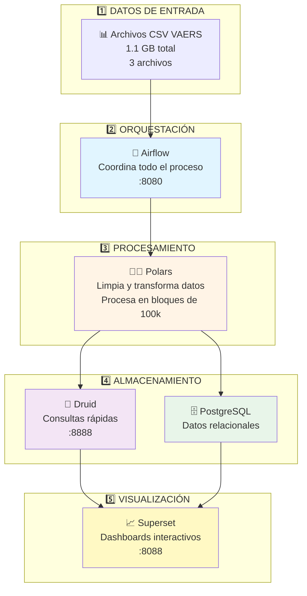
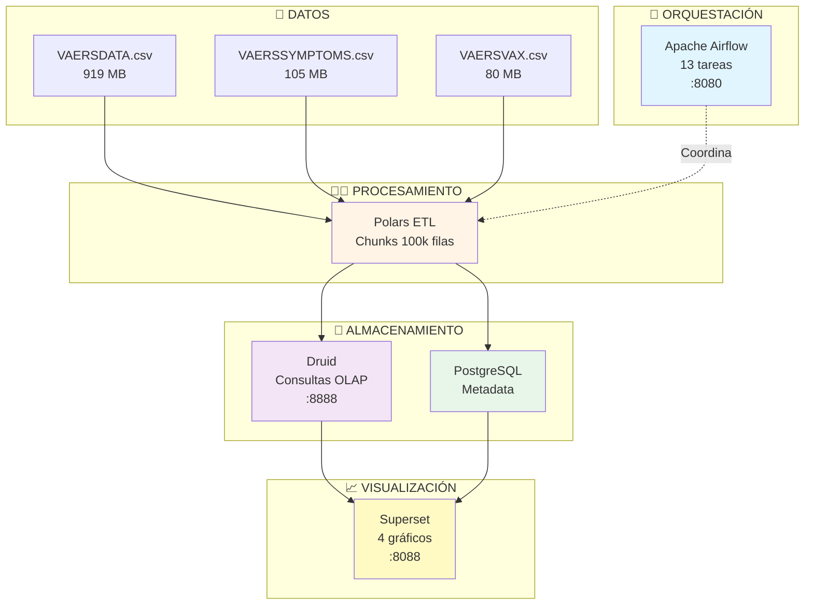
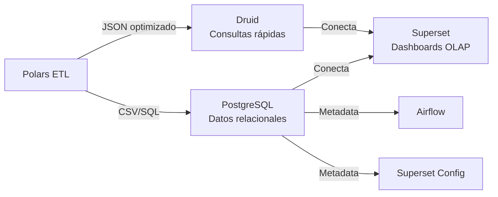
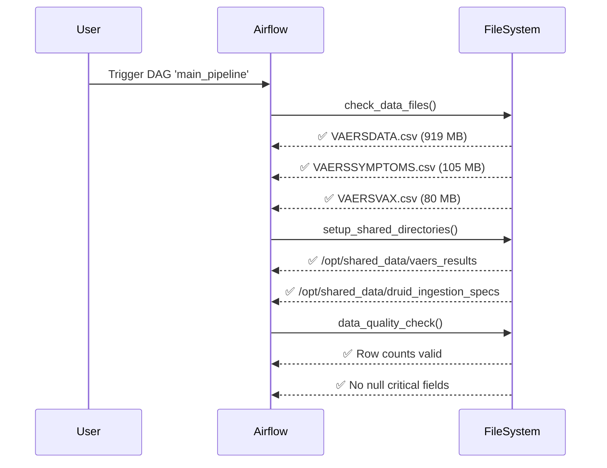
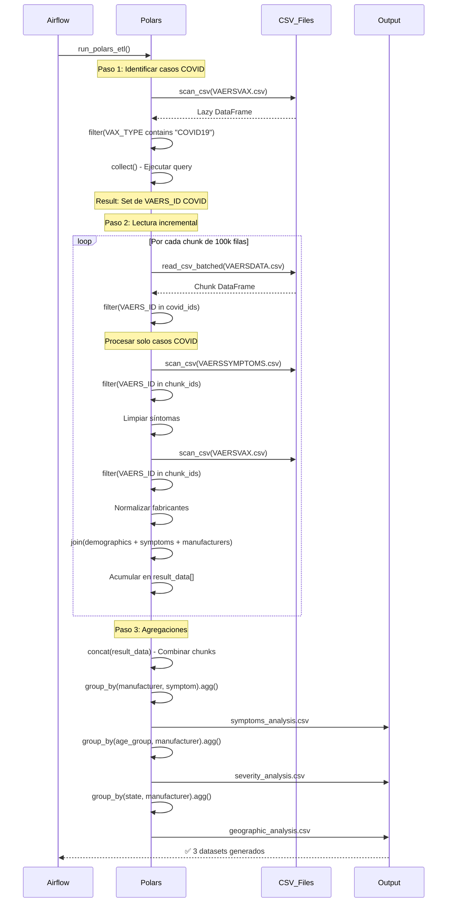
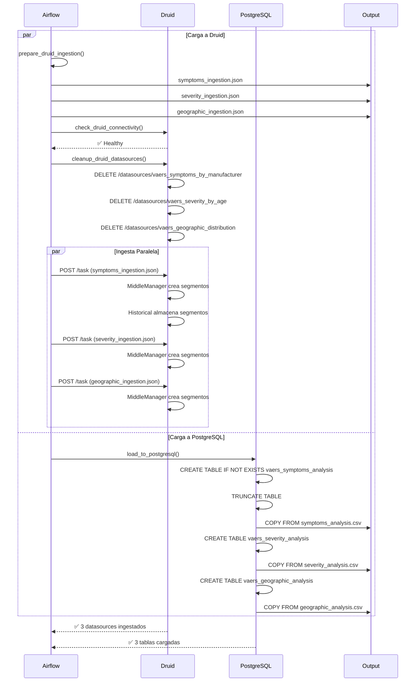
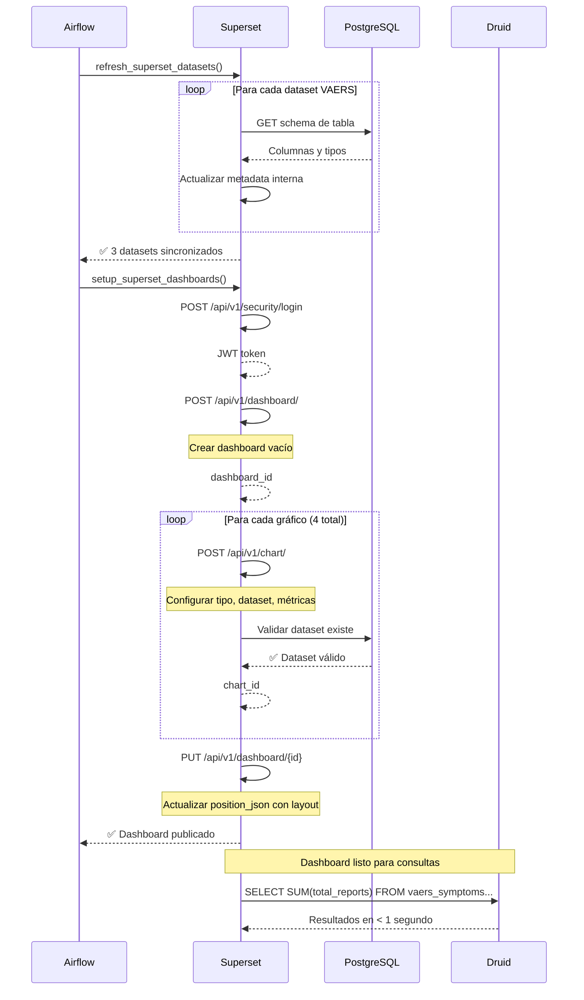

# Análisis de Efectos Adversos de Vacunas COVID-19 (VAERS)

**Autor: Valeria Chinchilla Mejías**

---

## 📑 Tabla de Contenidos

1. [Visión General](#-visión-general)
2. [Diagrama de Arquitectura](#️-diagrama-de-arquitectura)
3. [Decisiones de Diseño](#-decisiones-de-diseño)
4. [Componentes del Sistema](#-componentes-del-sistema)
5. [Estructura de Archivos](#-estructura-de-archivos)
6. [Flujo de Datos](#-flujo-de-datos-detallado)
7. [Cómo correr el proyecto?](#-cómo-correr-el-proyecto)

---

## 🎯 Visión General

Este proyecto implementa un pipeline automatizado de análisis de datos de farmacovigilancia utilizando tecnologías modernas de big data. El sistema procesa datos del VAERS (Vaccine Adverse Event Reporting System) relacionados con vacunas COVID-19.

### Objetivos Principales

1. **Procesamiento Eficiente**: Manejar 1.1 GB de datos CSV sin problemas de memoria
2. **Automatización Completa**: Pipeline totalmente automático sin intervención manual
3. **Análisis Multidimensional**: Insights por fabricante, edad, geografía y síntomas
4. **Visualización Interactiva**: Dashboards automáticos para exploración de datos

---

## 🏛️ Diagrama de Arquitectura

### Arquitectura Simplificada - Vista General



### ¿Cómo Funciona el Sistema?

**El flujo es simple**:

1. **📊 Datos Entran**: Archivos CSV con reportes de efectos adversos de vacunas
2. **🌊 Airflow Coordina**: Ejecuta automáticamente todas las tareas en orden
3. **🐻‍❄️ Polars Procesa**: Limpia, filtra y transforma los datos
4. **💾 Se Almacenan**: Druid (para consultas rápidas) y PostgreSQL (para metadata)
5. **📈 Se Visualizan**: Superset crea gráficos automáticamente

---

### Arquitectura Detallada

<details>
<summary>Click para ver diagrama completo con todos los componentes</summary>



</details>

---

## 💡 Decisiones de Diseño

### 1. ¿Por qué Polars en lugar de Apache Spark?

#### Ventajas de Polars para este proyecto

**Tamaño del Dataset Adecuado**

- Dataset total: 1.1 GB (VAERSDATA: 919 MB, VAERSSYMPTOMS: 105 MB, VAERSVAX: 80 MB)
- Polars maneja eficientemente datasets de varios GB en memoria
- No requiere infraestructura distribuida

**Rendimiento Superior**

```python
# Polars es 5-10x más rápido que Pandas para operaciones típicas
df = pl.read_csv_batched("data.csv", batch_size=100000)  # Lectura incremental
filtered = df.filter(pl.col("VAX_TYPE").str.contains("COVID19"))  # Optimizado en Rust
```

**API Intuitiva y Debugging Simple**

- Sintaxis clara y expresiva
- Stack traces comprensibles
- No requiere configuración de cluster

**Eficiencia de Memoria**

- Procesamiento en chunks de 100,000 filas
- Lazy evaluation con `scan_csv()` y `collect()`

**Simplicidad de Setup**

```dockerfile
# requirements-polars.txt
polars==0.20.0
# vs Spark que requiere:
# - Configuración de JVM
# - Gestión de executors
# - Tuning de memoria complicado
```

#### Problemas Evitados con Spark

1. **Complejidad Innecesaria**: Spark requiere master, workers, executors
2. **Overhead**: Para datasets < 10 GB, el overhead de distribución no compensa
3. **Recursos**: Spark consume significativamente más RAM y CPU
4. **Debugging Difícil**: Stack traces de JVM/Scala son crípticos
5. **Dependencias Pesadas**: JVM, Hadoop, py4j, etc.

**Conclusión**: Para datasets del orden de GB (no TB), Polars ofrece mejor rendimiento con menor complejidad.

---

### 2. ¿Por qué Dos Bases de Datos? (Druid + PostgreSQL)

Esta arquitectura **no es redundancia**, es **especialización funcional**.

#### 🐲 Apache Druid - Base de Datos Columnar OLAP

**Propósito**: Consultas analíticas de alta velocidad

**Casos de Uso**:

```sql
-- Consulta típica en Druid (sub-segundo para millones de filas)
SELECT
  manufacturer,
  SUM(total_reports) AS reports,
  SUM(deaths) AS deaths
FROM vaers_symptoms_by_manufacturer
WHERE __time >= '2021-01-01'
GROUP BY manufacturer
ORDER BY reports DESC
```

**Características Clave**:

- **Almacenamiento columnar**: Solo lee columnas necesarias
- **Pre-agregación**: Métricas calculadas durante ingesta
- **Particionamiento temporal**: Segmentos por día/mes
- **Compresión optimizada**: Reduce tamaño de datos 10-100x
- **Consultas paralelas**: Distribuye carga entre nodos

**Datasets en Druid**:

1. `vaers_symptoms_by_manufacturer`: Agregación de síntomas
2. `vaers_severity_by_age`: Métricas de severidad por edad
3. `vaers_geographic_distribution`: Distribución por estado

#### 🗄️ PostgreSQL - Base de Datos Relacional

**Propósito**: Metadata operacional y datos relacionales

**Casos de Uso**:

1. **Metadata de Airflow**: Estado de DAGs, logs, ejecuciones
2. **Metadata de Superset**: Configuración de dashboards, usuarios, permisos
3. **Datos procesados**: Tablas normalizadas para consultas ad-hoc

**Características Clave**:

- **ACID compliance**: Transacciones confiables
- **Joins complejos**: Relaciones entre tablas
- **Flexibilidad**: Schema mutable, índices configurables
- **Ecosistema maduro**: Extensiones, herramientas, soporte

**Tablas en PostgreSQL**:

```sql
-- Metadata de Airflow
airflow.dag_run
airflow.task_instance
airflow.log

-- Metadata de Superset
superset.dashboards
superset.slices (charts)
superset.tables (datasets)

-- Datos procesados (mismo contenido que Druid, diferente formato)
airflow.vaers_symptoms_analysis
airflow.vaers_severity_analysis
airflow.vaers_geographic_analysis
```

#### 🔄 Flujo de Integración



**¿Por qué no usar solo una?**

| Criterio                         | Druid               | PostgreSQL       |
| -------------------------------- | ------------------- | ---------------- |
| Consultas agregadas (SUM, COUNT) | ⚡ Sub-segundo      | 🐌 Segundos      |
| Joins complejos                  | ❌ Limitado         | ✅ Excelente     |
| Actualización de registros       | ❌ No soportado     | ✅ UPDATE/DELETE |
| Ingesta de datos                 | ⚡ Streaming        | 🐌 Batch         |
| Transacciones ACID               | ❌ No               | ✅ Sí            |
| Almacenamiento                   | 📦 Comprimido (10x) | 📦 Normal        |

**Conclusión**: Druid para analytics (velocidad), PostgreSQL para metadata y relaciones (flexibilidad).

---

### 3. ¿Por qué Apache Airflow para Orquestación?

1. **DAGs Explícitos**: Dependencias visuales claras
2. **Paralelización Automática**: Tareas independientes se ejecutan simultáneamente
3. **Retry Policies**: Reintentos automáticos ante fallos
4. **UI Integrada**: Monitoreo, logs, debugging visual
5. **Ecosistema Maduro**: 200+ operadores pre-construidos
6. **Python Nativo**: Fácil integración con Polars y scripts existentes

---

### 4. ¿Por qué Apache Superset para Visualización?

**Alternativas Consideradas**: Grafana, Metabase, Tableau

**Razones para Superset**:

1. **Integración Nativa con Druid**: Driver optimizado para consultas OLAP
2. **Configuración Programática**: API REST para automatizar dashboards

```python
# Crear dashboard mediante código
dashboard_config = {
    "dashboard_title": "VAERS COVID-19",
    "published": True,
    "charts": [chart1_id, chart2_id, chart3_id, chart4_id]
}
```

3. **SQL Lab**: Consultas ad-hoc para exploración
4. **Open Source**: Sin costos de licencia
5. **Extensible**: Python-based, plugins personalizables

---

## 🧩 Componentes del Sistema

### 1. 🌊 Apache Airflow - Orquestador del Pipeline

**Tareas del DAG** (13 en total):

1. **check_data_files**: Valida existencia de los CSV del VAERS
2. **setup_shared_directories**: Crea directorios de trabajo
3. **data_quality_check**: Verifica integridad de datos
4. **run_polars_etl**: Ejecuta transformaciones ETL
5. **check_druid_connectivity**: Verifica conexión a Druid
6. **prepare_druid_ingestion**: Genera specs JSON
7. **load_to_postgresql**: Carga a PostgreSQL
8. **cleanup_druid_datasources**: Limpia datos antiguos
9. **ingest_symptoms_to_druid**: Ingesta síntomas
10. **ingest_severity_to_druid**: Ingesta severidad
11. **ingest_geographic_to_druid**: Ingesta geografía
12. **refresh_superset_datasets**: Sincroniza schemas
13. **setup_superset_dashboards**: Crea visualizaciones

---

### 2. 🐻‍❄️ Polars - Motor ETL

**Versión**: 0.20.0

**Estrategia de Procesamiento**:

#### Lectura Incremental (Chunking)

```python
class VAERSChunkedETL:
    def __init__(self):
        self.chunk_size = 100000  # 100k filas por chunk

    def read_vaers_data_chunks(self, covid_ids: set):
        reader = pl.read_csv_batched(
            "VAERSDATA.csv",
            batch_size=self.chunk_size,
            encoding="utf8-lossy"
        )

        while True:
            chunk = reader.next_batches(1)
            if chunk is None:
                break

            # Procesar chunk inmediatamente
            processed = self.process_chunk(chunk[0], covid_ids)
            yield processed
```

**¿Por qué chunks?**

- Archivo VAERSDATA.csv: 919 MB
- Cargar completo requeriría ~2-3 GB RAM
- Chunks de 100k filas: ~200 MB por iteración
- Permite procesar en máquinas con RAM limitada

#### Lazy Evaluation

```python
# Escanear sin cargar en memoria
covid_ids = pl.scan_csv("VAERSVAX.csv").filter(
    pl.col("VAX_TYPE").str.contains("COVID19")
).select("VAERS_ID").collect()  # Solo aquí se ejecuta la query
```

#### Transformaciones Aplicadas

**1. Filtrado de Casos COVID-19**

```python
covid_vaccines = ["COVID19", "PFIZER\\BIONTECH", "MODERNA", "JANSSEN"]
df = df.filter(
    pl.col("VAX_TYPE_CLEAN").str.contains("COVID19") |
    pl.col("VAX_MANU_CLEAN").is_in(covid_vaccines)
)
```

**2. Normalización de Fabricantes**

```python
df = df.with_columns([
    pl.when(pl.col("manufacturer_raw").str.contains("PFIZER|BIONTECH"))
      .then(pl.lit("PFIZER"))
    .when(pl.col("manufacturer_raw").str.contains("MODERNA"))
      .then(pl.lit("MODERNA"))
    .when(pl.col("manufacturer_raw").str.contains("JANSSEN"))
      .then(pl.lit("JANSSEN"))
    .otherwise(pl.lit("OTHER")).alias("manufacturer")
])
```

**3. Depuración de Síntomas**

```python
# Eliminar síntomas administrativos
symptoms = symptoms.filter(
    ~pl.col("symptom_raw").str.contains(
        "VACCINATION|PRODUCT QUALITY|ADMINISTRATION ERROR"
    )
)

# Eliminar síntomas inespecíficos
symptoms = symptoms.filter(
    ~pl.col("symptom_raw").is_in([
        "PAIN", "FEVER", "HEADACHE", "NAUSEA", "FATIGUE"
    ])
)
```

**4. Categorización de Edad**

```python
df = df.with_columns([
    pl.when(pl.col("age_clean") < 18).then(pl.lit("0-17"))
    .when(pl.col("age_clean") < 30).then(pl.lit("18-29"))
    .when(pl.col("age_clean") < 40).then(pl.lit("30-39"))
    # ... más categorías
    .otherwise(pl.lit("80+")).alias("age_group")
])
```

**5. Cálculo de Métricas**

```python
severity_analysis = df.group_by(["age_group", "manufacturer"]).agg([
    pl.len().alias("total_cases"),
    pl.sum("died_flag").alias("deaths"),
    pl.sum("hospital_flag").alias("hospitalizations"),
    pl.mean("age_clean").alias("avg_age"),
    (pl.sum("died_flag") / pl.len()).alias("death_rate"),
    (pl.sum("hospital_flag") / pl.len()).alias("hospital_rate")
])
```

---

### 3. 🐲 Apache Druid - Base de Datos Columnar

**Arquitectura Distribuida**:

```
┌─────────────────────────────────────────────────────┐
│              Cliente (Superset)                      │
└──────────────────┬──────────────────────────────────┘
                   │ SQL Query
                   ▼
┌─────────────────────────────────────────────────────┐
│         Router (Puerto 8888)                         │
│         • Punto de entrada único                     │
│         • Enrutamiento de consultas                  │
└──────────────────┬──────────────────────────────────┘
                   │
                   ▼
┌─────────────────────────────────────────────────────┐
│         Broker (Puerto 8082)                         │
│         • Recibe consultas SQL/JSON                  │
│         • Planifica ejecución distribuida            │
│         • Combina resultados                         │
└──────────┬──────────────────────┬───────────────────┘
           │                      │
           ▼                      ▼
┌──────────────────┐    ┌──────────────────┐
│   Historical     │    │   Historical     │
│   • Segmentos    │    │   • Segmentos    │
│     antiguos     │    │     recientes    │
│   • Datos        │    │   • Cache en     │
│     en disco     │    │     memoria      │
└──────────────────┘    └──────────────────┘
           ▲
           │
           │ Carga de segmentos
           │
┌──────────────────────────────────────────────────────┐
│         Coordinator                                   │
│         • Gestiona segmentos                         │
│         • Balancea carga                             │
│         • Políticas de retención                     │
└──────────────────┬───────────────────────────────────┘
                   │
                   │ Creación de segmentos
                   │
┌──────────────────▼───────────────────────────────────┐
│         MiddleManager                                 │
│         • Recibe tareas de ingesta                   │
│         • Crea segmentos desde JSON                  │
│         • Publica a deep storage                     │
└───────────────────────────────────────────────────────┘
```

**Especificación de Ingesta**:

```json
{
  "type": "index_parallel",
  "spec": {
    "dataSchema": {
      "dataSource": "vaers_symptoms_by_manufacturer",
      "timestampSpec": {
        "column": "__time",
        "format": "iso"
      },
      "dimensionsSpec": {
        "dimensions": ["manufacturer", "symptom"]
      },
      "metricsSpec": [
        {
          "name": "total_reports",
          "type": "longSum",
          "fieldName": "total_reports"
        },
        { "name": "deaths", "type": "longSum", "fieldName": "deaths" }
      ],
      "granularitySpec": {
        "segmentGranularity": "DAY",
        "queryGranularity": "NONE"
      }
    },
    "ioConfig": {
      "type": "index_parallel",
      "inputSource": {
        "type": "local",
        "baseDir": "/opt/shared_data/vaers_results",
        "filter": "chunked_symptoms_for_druid.json"
      },
      "inputFormat": { "type": "json" }
    }
  }
}
```

**Ventajas del Diseño**:

- **Inmutabilidad**: Segmentos son write-once
- **Compresión**: Datos se comprimen ~10x
- **Índices**: Bitmap indexes para filtros rápidos
- **Paralelización**: Queries distribuidas automáticamente

---

### 4. 📈 Apache Superset - Plataforma de Visualización

**Configuración Programática**:

```python
# superset/dashboard_setup.py
def build_complete_vaers_dashboard():
    # 1. Autenticación
    login_response = requests.post(
        f"{base_url}/api/v1/security/login",
        json={"username": "admin", "password": "admin"}
    )
    access_token = login_response.json()["access_token"]

    # 2. Crear dashboard
    dashboard = requests.post(
        f"{base_url}/api/v1/dashboard/",
        headers={"Authorization": f"Bearer {access_token}"},
        json={"dashboard_title": "VAERS COVID-19", "published": True}
    )
    dashboard_id = dashboard.json()["id"]

    # 3. Crear gráficos
    charts = []
    for chart_config in chart_configs:
        chart = requests.post(
            f"{base_url}/api/v1/chart/",
            json={
                "slice_name": chart_config["name"],
                "datasource_id": dataset_id,
                "viz_type": chart_config["type"],
                "params": json.dumps(chart_config["params"]),
                "dashboards": [dashboard_id]
            }
        )
        charts.append(chart.json()["id"])

    # 4. Actualizar layout del dashboard
    requests.put(
        f"{base_url}/api/v1/dashboard/{dashboard_id}",
        json={"position_json": generate_layout(charts)}
    )
```

**Dashboards Creados**:

1. **Gráfico Circular**: Distribución por fabricante
   - Dataset: `vaers_symptoms_analysis`
   - Métrica: `SUM(total_reports)`
2. **Gráfico de Barras**: Top 15 síntomas
   - Dataset: `vaers_symptoms_analysis`
   - Filtro: `row_limit: 15`
3. **Gráfico de Barras**: Hospitalizaciones por edad
   - Dataset: `vaers_severity_analysis`
   - Métrica: `SUM(hospitalizations)`
4. **Gráfico de Barras**: Distribución geográfica
   - Dataset: `vaers_geographic_analysis`

---

## 📁 Estructura de Archivos

```
adverse-effects-covid/
│
├── 📊 data/                              # Datos de entrada (1.1 GB)
│   ├── VAERSDATA.csv                     # 919 MB - Datos demográficos y severidad
│   ├── VAERSSYMPTOMS.csv                # 105 MB - Síntomas reportados
│   └── VAERSVAX.csv                     # 80 MB - Información de vacunas
│
├── 🌊 dags/                              # Definiciones de Airflow DAGs
│   ├── main_pipeline.py                 # DAG principal (13 tareas)
│   │   ├── check_data_files()           #   └─ Valida archivos CSV
│   │   ├── setup_shared_directories()   #   └─ Crea directorios
│   │   ├── data_quality_check()         #   └─ Verifica calidad
│   │   ├── run_polars_etl()             #   └─ Ejecuta ETL
│   │   ├── prepare_druid_ingestion()    #   └─ Genera specs
│   │   ├── cleanup_druid_datasources()  #   └─ Limpia Druid
│   │   ├── ingest_*_to_druid()          #   └─ Ingesta datos
│   │   ├── refresh_superset_datasets()  #   └─ Sincroniza schemas
│   │   └── setup_superset_dashboards()  #   └─ Crea visualizaciones
│   │
│   └── helpers.py                        # Funciones auxiliares
│       ├── check_required_files()        #   └─ Validación de archivos
│       ├── check_data_quality()          #   └─ Control de calidad
│       ├── make_druid_spec()             #   └─ Generador de specs JSON
│       ├── cleanup_druid_datasource()    #   └─ Limpieza de datos
│       ├── load_to_postgresql()          #   └─ Carga a PostgreSQL
│       └── refresh_superset_datasets()   #   └─ Actualiza metadata
│
├── 🐻‍❄️ etl/                             # Procesamiento con Polars
│   └── etl_processor.py                 # Pipeline ETL principal
│       └── class VAERSChunkedETL
│           ├── get_covid_ids()          #   └─ Identifica casos COVID
│           ├── read_vaers_data_chunks() #   └─ Lectura incremental
│           ├── process_chunk()          #   └─ Transforma datos
│           ├── clean_analysis_data()    #   └─ Limpieza y filtros
│           └── generate_analyses()      #   └─ Genera agregaciones
│
├── 📈 superset/                          # Scripts de visualización
│   ├── dashboard_setup.py               # Creación automática de dashboards
│   │   └── build_complete_vaers_dashboard()
│   │       ├── Autenticación JWT        #   └─ Login API
│   │       ├── Crear dashboard          #   └─ POST /api/v1/dashboard
│   │       ├── Crear gráficos (4)       #   └─ POST /api/v1/chart
│   │       └── Actualizar layout        #   └─ PUT /api/v1/dashboard/{id}
│   │
│   ├── dataset_manager.py               # Gestión de datasets
│   │   └── refresh_superset_datasets()
│   │       └── Sincroniza schemas       #   └─ PUT /api/v1/dataset/{id}/refresh
│   │
│   └── dashboard_validator.py           # Validación post-deployment
│       └── verify_complete_dashboard()
│           ├── Verifica datasets (3)    #   └─ GET /api/v1/dataset
│           ├── Verifica gráficos (4)    #   └─ GET /api/v1/chart
│           └── Verifica dashboards (1)  #   └─ GET /api/v1/dashboard
│
├── 🐳 Configuración Docker
│   ├── docker-compose.yml               # Orquestación de 12 servicios
│   │   ├── volume-init                  #   └─ Inicialización de volúmenes
│   │   ├── postgres                     #   └─ PostgreSQL 13
│   │   ├── airflow-init                 #   └─ Setup de Airflow
│   │   ├── airflow-webserver            #   └─ UI de Airflow (8080)
│   │   ├── airflow-scheduler            #   └─ Ejecutor de tareas
│   │   ├── zookeeper                    #   └─ Coordinación Druid
│   │   ├── druid-coordinator            #   └─ Gestión de segmentos
│   │   ├── druid-broker                 #   └─ Distribuidor de consultas
│   │   ├── druid-historical             #   └─ Almacenamiento de datos
│   │   ├── druid-middlemanager          #   └─ Ingesta de datos
│   │   ├── druid-router                 #   └─ Punto de entrada (8888)
│   │   ├── superset                     #   └─ Visualizaciones (8088)
│   │
│   ├── requirements-polars.txt          # Dependencias Python
│   │   ├── polars==0.20.0               #   └─ Motor ETL
│   │   ├── sqlalchemy==2.0.23           #   └─ ORM para PostgreSQL
│   │   ├── psycopg2-binary==2.9.9       #   └─ Driver PostgreSQL
│   │   └── requests==2.31.0             #   └─ HTTP client
│   │
│   ├── superset_config.py               # Configuración de Superset
│   │   ├── SQLALCHEMY_DATABASE_URI      #   └─ Conexión a PostgreSQL
│   │   ├── DRUID_BROKER_HOST            #   └─ Conexión a Druid
│   │   ├── FEATURE_FLAGS                #   └─ Funcionalidades habilitadas
│   │   └── CACHE_CONFIG                 #   └─ Cache en filesystem
│   │
│   └── init-db.sh                       # Inicialización de bases de datos
│       └── Crea schemas y usuarios      #   └─ airflow, superset, marquez
│
├── 📚 Documentación
│   ├── README.md                         # Documentación principal
│   ├── ARQUITECTURA.md                   # Este archivo (documentación detallada)
│
└── 🔧 Archivos de Configuración
    ├── .gitignore                        # Archivos excluidos de Git
    └── environment                       # Variables de entorno para Druid
```

---

## 🔄 Flujo de Datos Detallado

### Fase 1: Ingesta y Validación



### Fase 2: Procesamiento ETL con Polars



### Fase 3: Carga Paralela a Bases de Datos



### Fase 4: Configuración de Visualizaciones



---

## 🚀 Cómo correr el proyecto

### Requisitos Previos

```bash
# Software necesario
- Docker Desktop 4.0+ (con Docker Compose v2)
- 16 GB RAM mínimo (recomendado: 32 GB)
- 20 GB espacio en disco
- macOS, Linux o Windows con WSL2
```

### Paso 1: Clonar Repositorio

```bash
git clone https://github.com/valeriach30/adverse-effects-covid.git
cd adverse-effects-covid
```

### Paso 2: Iniciar Sistema

```bash
# Iniciar todos los servicios
docker compose up -d

# Verificar que todos los contenedores están corriendo
docker compose ps

# Esperar a que servicios estén listos (~2-3 minutos)
docker compose logs -f airflow-init  # Esperar mensaje "Airflow initialized"
```

### Paso 3: Acceder a Interfaces

| Servicio      | URL                   | Credenciales  |
| ------------- | --------------------- | ------------- |
| Airflow       | http://localhost:8080 | admin / admin |
| Druid Console | http://localhost:8888 | -             |
| Superset      | http://localhost:8088 | admin / admin |

### Paso 4: Ejecutar Pipeline

Desde la interfaz web de Airflow:

1. Abrir navegador en http://localhost:8080
2. Iniciar sesión con:
   - Usuario: `admin`
   - Contraseña: `admin`
3. En la página principal estarán la lista de DAGs
4. Buscar el DAG llamado `main_pipeline`
5. Activar el DAG si está pausado (toggle en la columna izquierda ⏸️ → ▶️)
6. Click en el botón **▶️ Play** en el lado derecho del DAG
7. Seleccionar **Trigger DAG** para iniciar la ejecución

### Paso 5: Monitorear la Ejecución

Una vez iniciado el pipeline, se puede monitorear su progreso:

1. **Ver el progreso en tiempo real:**

   - En Airflow UI, click en el nombre del DAG `main_pipeline`
   - Hay un gráfico con las 13 tareas del pipeline

2. **Ver logs de una tarea específica:**

   - Click en el cuadro de la tarea en el gráfico
   - Seleccionar **Log** en el menú emergente
   - Se puedenn ver los logs detallados de esa tarea

3. **Tiempo estimado:** El pipeline completo tarda aproximadamente **3-4 minutos** en ejecutarse

### Paso 8: Acceder a Dashboard

```bash
# 1. Abrir Superset
open http://localhost:8088

# 2. Login con admin/admin

# 3. Buscar dashboard "VAERS COVID-19"
# Debería ver 4 visualizaciones:
#   - Gráfico circular de fabricantes
#   - Gráfico de barras de síntomas
#   - Gráfico de barras de hospitalizaciones
#   - Gráfico de barras de estados
```

---

## 📊 Métricas de Rendimiento

### Volúmenes de Datos Procesados

| Dataset       | Tamaño Original | Filas Totales | Filas Filtradas (COVID) | Reducción |
| ------------- | --------------- | ------------- | ----------------------- | --------- |
| VAERSDATA     | 919 MB          | ~1,012,894    | ~1,012,894              | 0%        |
| VAERSSYMPTOMS | 105 MB          | ~1,363,171    | ~878,257                | 35.6%     |
| VAERSVAX      | 80 MB           | ~1,073,516    | ~1,073,516              | 0%        |

### Tiempos de Ejecución

| Tarea                     | Tiempo         | Notas                        |
| ------------------------- | -------------- | ---------------------------- |
| check_data_files          | 0.00s          | Validación rápida            |
| setup_shared_directories  | 0.00s          | Setear directorios           |
| data_quality_check        | 0.09s          | Verifica integridad de datos |
| run_polars_etl            | 61.59s         | Procesa ~193 chunks          |
| check_druid_connectivity  | 0.05s          | Verifica conexión a Druid    |
| prepare_druid_ingestion   | 0.00s          | Genera 3 specs JSON          |
| load_to_postgresql        | 0.25s          | Carga 3 tablas               |
| cleanup_druid_datasources | 15.32s         | Elimina segmentos antiguos   |
| refresh_superset_datasets | 14.93s         | Sincroniza schemas           |
| setup_superset_dashboards | 30.46s         | 4 gráficos via API           |
| **TOTAL**                 | **~2 minutos** | Pipeline completo            |

---

## 🔮 Futuras Mejoras

### 1. Optimizaciones de Rendimiento

- **Airflow**: Migrar a CeleryExecutor para paralelización real
- **Polars**: Aumentar chunk_size a 500k en máquinas con más RAM
- **Druid**: Configurar partitioning por mes para queries más rápidas

### 2. Nuevas Funcionalidades

- **Análisis Temporal**: Evolución de reportes por mes/año
- **Correlaciones**: Análisis de co-ocurrencia de síntomas
- **Machine Learning**: Clustering de perfiles de efectos adversos
- **Alertas**: Notificaciones cuando métricas superan umbrales

### 3. Integración con Herramientas Externas

- **Apache Kafka**: Ingesta streaming de datos en tiempo real
- **Apache Spark**: Para análisis de datasets > 10 GB
- **dbt**: Transformaciones declarativas y testing de datos
- **Great Expectations**: Validación automática de calidad de datos

---

## 📚 Referencias y Recursos

### Documentación Oficial

- [Polars User Guide](https://pola-rs.github.io/polars-book/)
- [Apache Airflow Docs](https://airflow.apache.org/docs/)
- [Apache Druid Docs](https://druid.apache.org/docs/latest/design/)
- [Apache Superset Docs](https://superset.apache.org/docs/intro)

### Dataset

- [COVID-19 World Vaccine Adverse Reactions](https://www.kaggle.com/datasets/ayushggarg/covid19-vaccine-adverse-reactions?resource=download)

---

**Última actualización**: Diciembre 2025  
**Autor**: Valeria Chinchilla Mejías  
**Repositorio**: https://github.com/valeriach30/adverse-effects-covid
